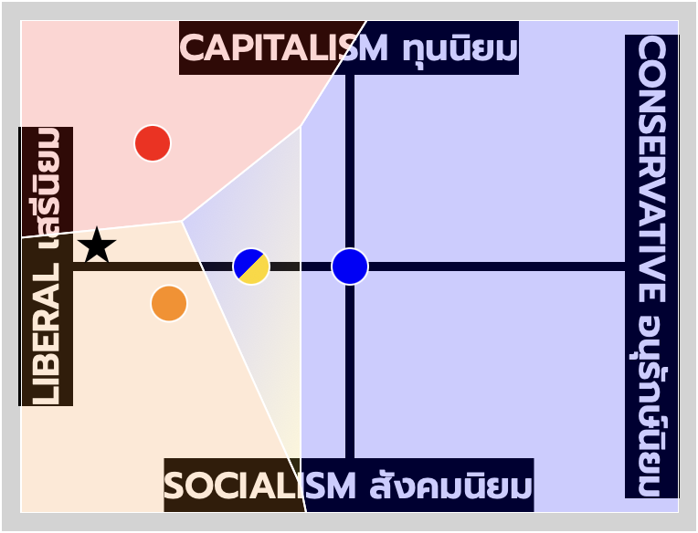

# คุณอยู่ตรงไหน Political Spectrum Poll

ความเชื่อทางการเมืองของคุณอยู่ตรงไหน? ใกล้พรรคอะไร? โดยใช้ข้อมูลจาก พรรคนี้อยู่ตรงไหน? ในรายการ [พรรคนี้เป็นไงบ้าง?](https://www.youtube.com/playlist?list=PLg523oxEzw_ZgLDw6TyuVGaydyC1uMOA8) โดย [FAROSE](https://www.youtube.com/@FAROSECHANNEL)

## TODO

ให้แสดงความเห็นว่าแต่ละพรรคอยู่ใน spectrum ไหนแบบในงาน [Good, Evil, Ugly, Beautiful: Help Us Make a ‘Game of Thrones’ Chart](https://www.nytimes.com/interactive/2017/08/09/upshot/game-of-thrones-chart.html) โดย New York Times

